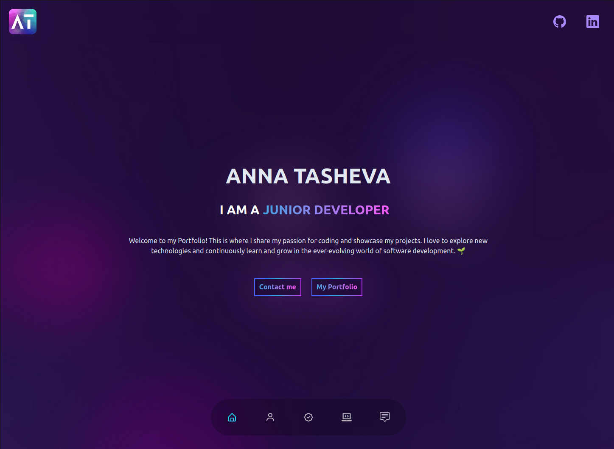

# My Portfolio Website

Welcome to my Portfolio website – built with a powerful stack that includes React, Vite, and Tailwind CSS. This trio of technologies makes sure the website works smoothly and delivers a great user experience.

### Explore my portfolio website live at: https://hi-anna.com/

## Tech Stack

-   **React:** A powerful JavaScript library for building user interfaces. It provides a robust foundation for creating dynamic and interactive components.

-   **Vite:** A build tool that focuses on speed and efficiency. It allows for lightning-fast development and seamless hot module replacement.

-   **Tailwind CSS:** A utility-first CSS framework that enables rapid UI development with pre-designed utility classes. It promotes consistency and responsiveness.

-   **Framer Motion:** A React animation library that facilitates smooth and sophisticated animations and transitions, enhancing the user experience.

-   **React Scroll:** A popular library that simplifies smooth scrolling within a React application, making navigation more elegant and user-friendly.

## Key Features

-   🚀 **Cutting-Edge Technology:** The Portfolio website is powered by a robust tech stack, resulting in a seamless and visually appealing experience.

-   📱 **Fully Responsive:** I've taken the extra effort to ensure that the website functions smoothly on various devices and screen sizes.

-   ⚡ **Smooth Scroll with Framer Motion and React Scroll:** With the integration of Framer Motion and React Scroll, scrolling through the website is incredibly smooth, which adds a touch of elegance to the navigation.

-   ✅ **Best Practices and Standards:** I've followed the best practices and industry standards to enure the application's reliability, scalability, and overall robustness.
