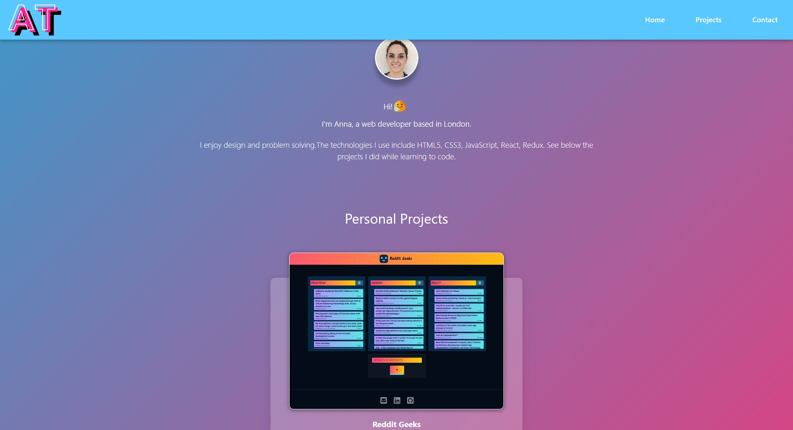

# Portfolio

Web Development

# Table of Contents
- [Screenshots](#screenshots)
- [See live](#live)
- [Features](#features)
- [Technologies](#technologies)
- [Scripts](#scripts)

# Screenshots

# See live 
https://annatas77.github.io/portfolio-anna/

# Features

+ Responsive navigation bar with a dropdown menu available for the mobile version of the website.

+ Responsive web design approach used to create content that adjusts smoothly to various screen sizes.

# Technologies

+ React
+ CSS

# Scripts

In the project directory, you can run:

`npm start`

Runs the app in the development mode.

Open http://localhost:3000 to view it in the browser.

The page will reload if you make edits.